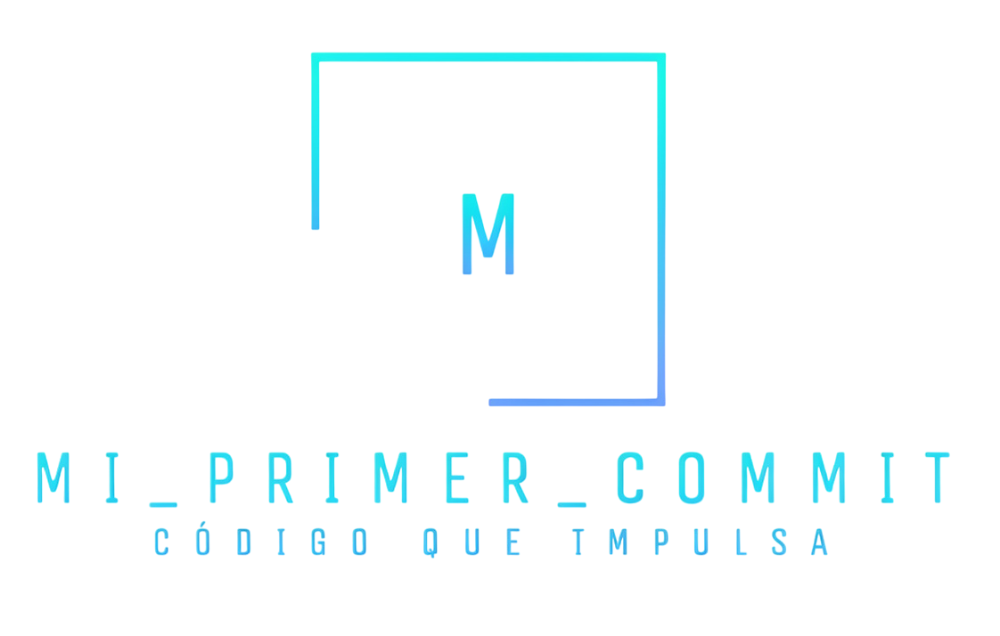
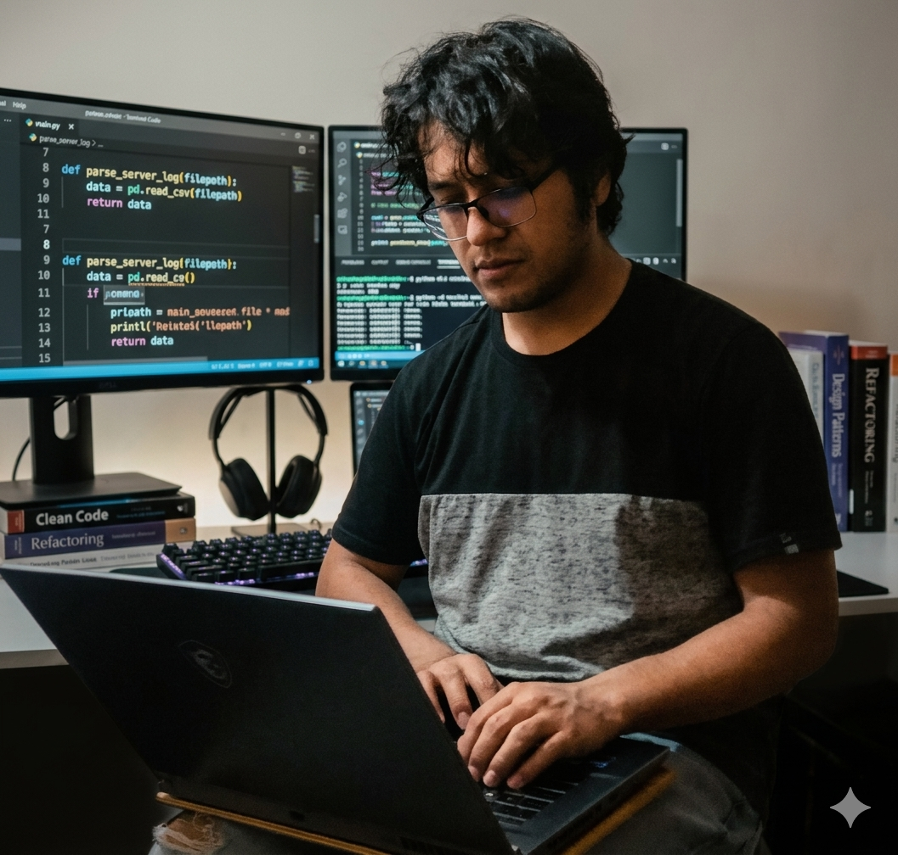
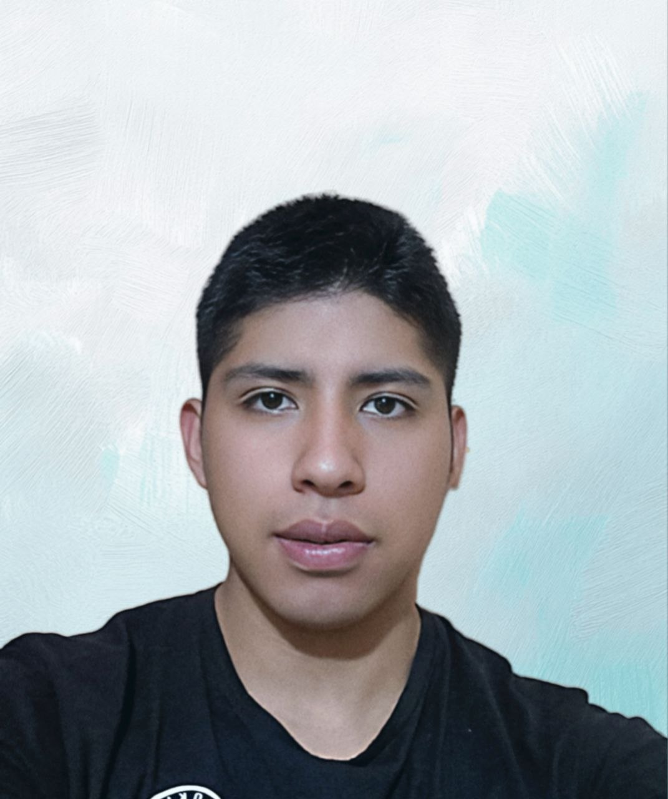
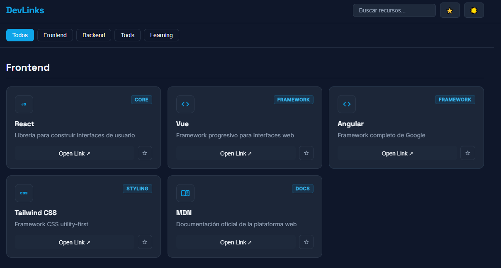

# 🌐 DevLinks

### 📚 Portal de enlaces útiles para programadores

 

<!-- Badges -->

  
  
  
  

## 👥 Equipo de Desarrollo: Mi_primer_commit

<table>
<tr>

<td width="50%">
<table><tr>
<td></td>
<td>

**🧑‍💻 Leonardo Mena Morante** 
 
📧 leonardomenamorante@gmail.com 
📱 +591 69588990

</td>
</tr></table>
</td>

<td width="50%">
<table><tr>
<td></td>
<td>

**🧑‍🎨 Emanuel** 
 
📧 emanuel.hurtado.cast@gmail.com 
📱 +591 77424836

</td>
</tr></table>
</td>

</tr>
<tr>

<td width="50%">
<table><tr>
<td></td>
<td>

**⚙️ Cristofer** 
 
📧 cristoferop2005@gmail.com 
📱 +591 67489206

</td>
</tr></table>
</td>

<td width="50%">
<table><tr>
<td></td>
<td>

**🧩 Alan** 
 
📧 alanmora011299@gmail.com 
📱 +591 62615493

</td>
</tr></table>
</td>

</tr>
</table>

---

## 📖 Descripción del Proyecto

### 🚀 ¿Qué es DevLinks?

<strong>DevLinks</strong> es una aplicación web de una sola página que organiza recursos útiles para desarrolladores en distintas categorías.
 

### ✨ Funcionalidades principales

  
  
  
  
  

<ul>
  <li>🔎 Buscar recursos en tiempo real</li>
  <li>⭐ Marcar favoritos</li>
  <li>🧭 Filtrar por categorías</li>
  <li>🌙 Cambiar tema claro/oscuro</li>
  <li>📦 Render dinámico de contenido</li>
</ul>

 

### 🧠 Enfoque técnico

El proyecto está construido con una <strong>arquitectura modular</strong>, separando:

<ul>
  <li>📂 Datos</li>
  <li>⚙️ Lógica</li>
  <li>🧩 Componentes</li>
  <li>🎨 Estilos</li>
</ul>

---

## 🖼️ Vista previa

  

---

## 🧱 Arquitectura del Proyecto

### 📂 Estructura de carpetas

<pre style="background:#010409; padding:15px; border-radius:10px; border:1px solid #30363d; color:#58A6FF; overflow:auto;">
js/
├── 📁 data/         → Fuente de datos
├── 📁 components/   → UI reutilizable
├── 📁 features/     → Lógica por funcionalidad
├── 📁 utils/        → Funciones auxiliares
└── ⚙️ app.js        → Punto de entrada
</pre>

 

### 🧠 Enfoque

Se sigue una arquitectura <strong>modular y desacoplada</strong>, permitiendo:

<ul>
  <li>🔄 Escalabilidad del proyecto</li>
  <li>🧩 Reutilización de componentes</li>
  <li>🧪 Facilidad de mantenimiento y testing</li>
  <li>🚀 Integración progresiva de features</li>
</ul>

---

## 🔀 Git Flow Utilizado

### 🌿 Estructura de ramas

<pre style="background:#010409; padding:15px; border-radius:10px; border:1px solid #30363d; color:#f78166; overflow:auto;">
main
└── develop
    ├── feature/initial-structure
    ├── feature/core-data-state
    ├── feature/ui-html-css
    ├── feature/filter-storage
    ├── feature/components
    ├── feature/core-integration
    ├── feature/ui-polish
    ├── feature/filter-favorites
    ├── feature/theme-fav-polish
    └── release/v1.0.0
</pre>

 

### 📌 Buenas prácticas

<ul>
  <li>🚫 No se trabaja directamente en <code>main</code></li>
  <li>🌱 Todo parte desde <code>develop</code></li>
  <li>👨‍💻 Cada integrante usa su propia rama</li>
  <li>🔁 Integración mediante Pull Requests</li>
  <li>📝 Commits con convención:
    <ul>
      <li><code style="color:#58A6FF;">feat:</code> nueva funcionalidad</li>
      <li><code style="color:#f78166;">fix:</code> corrección de errores</li>
      <li><code style="color:#d2a8ff;">style:</code> cambios visuales</li>
    </ul>
  </li>
</ul>

 

### 🚀 Flujo de Release (Producción)

<pre style="background:#010409; padding:15px; border-radius:10px; border:1px solid #30363d; color:#58A6FF; overflow:auto;">
develop
   ↓
release/v1.0.0
   ↓        ↓
develop   main
              ↓
           tag v1.0.0
</pre>

 

### 📦 Proceso de publicación

<ul>
  <li>1️⃣ Se crea una rama <code>release/v1.0.0</code> desde <code>develop</code></li>
  <li>2️⃣ Se realizan ajustes finales (README, fixes, detalles UI)</li>
  <li>3️⃣ Se abre PR: <code>release → main</code></li>
  <li>4️⃣ Se hace merge a <code>main</code> (versión estable)</li>
  <li>5️⃣ Se crea un <strong>tag</strong> (<code>v1.0.0</code>)</li>
  <li>6️⃣ Se publica un <strong>Release</strong></li>
  <li>7️⃣ Se sincroniza <code>develop</code> con los cambios finales</li>
  <li>8️⃣ Se elimina la rama <code>release</code></li>
</ul>

 

### 🧠 Notas clave

<ul>
  <li>🏷️ El <strong>tag</strong> marca una versión exacta del proyecto</li>
  <li>📦 El <strong>Release</strong> documenta la versión (features y cambios)</li>
  <li>🔄 <code>develop</code> se sincroniza para evitar inconsistencias</li>
  <li>🚫 No se agregan nuevas funcionalidades en <code>release</code></li>
</ul>

---

## 🛠️ Tecnologías Utilizadas

  

---

## 📊 Product & Sprint Backlog

### 🧠 Product Backlog

Historias de usuario principales del sistema DevLinks

<table style="width:100%; border-collapse:collapse;">
<tr style="background:#161b22;">
<th align="left">ID</th>
<th align="left">Funcionalidad</th>
<th align="left">Prioridad</th>
</tr>

<tr><td>HU-01</td><td>📂 Ver recursos por categoría</td><td>🔴 Alta</td></tr>
<tr><td>HU-02</td><td>🔗 Abrir enlaces de recursos</td><td>🔴 Alta</td></tr>
<tr><td>HU-03</td><td>📦 Cargar recursos desde JS</td><td>🔴 Alta</td></tr>
<tr><td>HU-04</td><td>➕ Agregar nuevos recursos</td><td>🔴 Alta</td></tr>
<tr><td>HU-05</td><td>🔎 Búsqueda en tiempo real</td><td>🟡 Media</td></tr>
<tr><td>HU-06</td><td>🧭 Filtro por categoría</td><td>🟡 Media</td></tr>
<tr><td>HU-07</td><td>⭐ Guardar favoritos</td><td>🟡 Media</td></tr>
<tr><td>HU-08</td><td>📌 Ver favoritos</td><td>🟡 Media</td></tr>
<tr><td>HU-09</td><td>🌙 Tema claro/oscuro</td><td>🟡 Media</td></tr>

</table>

### ⚡ Sprint Backlog (2 días)

Implementación incremental basada en arquitectura modular

#### 📅 Día 1 — Base del sistema

<ul>
  <li>📦 Configuración de datos (<code>resources.js</code>)</li>
  <li>🧠 Estado global (<code>app.js</code>)</li>
  <li>🎨 Estructura HTML + CSS base</li>
  <li>🧩 Componentes UI (cards, navbar, sections)</li>
  <li>💾 Persistencia (localStorage)</li>
</ul>

#### 📅 Día 2 — Integración y features

<ul>
  <li>🔗 Render dinámico de recursos</li>
  <li>🔎 Buscador en tiempo real</li>
  <li>🧭 Filtro por categoría</li>
  <li>⭐ Sistema de favoritos persistente</li>
  <li>🌙 Tema claro/oscuro</li>
  <li>✨ UI responsive + efectos visuales</li>
</ul>

✔ Desarrollo paralelo sin conflictos 
✔ Separación clara por responsabilidades 
✔ Integración progresiva en <code>develop</code>

### 📄 Backlog completo

<a href="https://docs.google.com/spreadsheets/d/1KR9LucQOFZPJ3hvLBLEKB4olyN-3C_Ygqqy0Pi0v_r0/edit?usp=sharing" target="_blank" 
style="display:inline-block; padding:10px 15px; background:#1f6feb; color:white; border-radius:8px; text-decoration:none;">
🔗 Ver backlog detallado (Google Sheets)
</a>

---

## 🚀 Cómo ejecutar el proyecto

### 📥 Instalación

<pre style="background:#010409; padding:15px; border-radius:10px; border:1px solid #30363d; color:#58A6FF;">
git clone git@github.com:leonardo2014321/proyecto-git-scesi.git
cd proyecto-git-scesi
</pre>

 

### ▶️ Ejecución

### ⚠️ Nota importante

Este proyecto utiliza módulos de JavaScript, por lo que **no funcionará correctamente abriendo el archivo `index.html` directamente** debido a restricciones de CORS del navegador.

Es necesario ejecutar un servidor local.

 

### 📦 Requisitos

- Tener instalado <strong>Node.js</strong> (incluye <code>npm</code>)
- Verificar instalación:

<pre style="background:#010409; padding:15px; border-radius:10px; border:1px solid #30363d; color:#58A6FF;">
node -v
npm -v
</pre>

 

### 🚀 Opción recomendada

Ejecutar un servidor local con <code>npx</code>:

<pre style="background:#010409; padding:15px; border-radius:10px; border:1px solid #30363d; color:#3fb950;">
npx serve
</pre>

Luego abrir en el navegador:

<pre style="background:#010409; padding:15px; border-radius:10px; border:1px solid #30363d; color:#58A6FF;">
http://localhost:3000
</pre>

 

### 🔁 Alternativa

<pre style="background:#010409; padding:15px; border-radius:10px; border:1px solid #30363d; color:#3fb950;">
npx http-server
</pre>

 

### 💡 Recomendación adicional

También puedes usar la extensión <strong>Live Server</strong> en VS Code para ejecutar el proyecto fácilmente.

---

<pre style="background:#010409; padding:18px; border-radius:12px; color:#58A6FF; border:1px solid #30363d;">
🚀 Proyecto académico — SCESI  
👥 Trabajo en equipo con Git Flow  
✨ DevLinks 2026
</pre>

